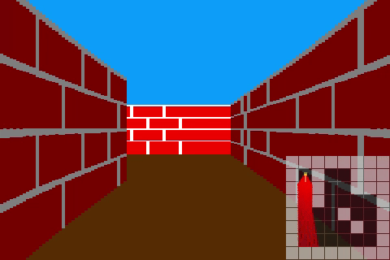

# simple-3d-raycaster
A simple 3D raycaster test written in C



# Building
To build this project from the command line, run the following commands:
```Shell
mkdir build && cd build
cmake ..
# Default build:
cmake --build .
# Debug build:
cmake --build .  --config Debug
```

